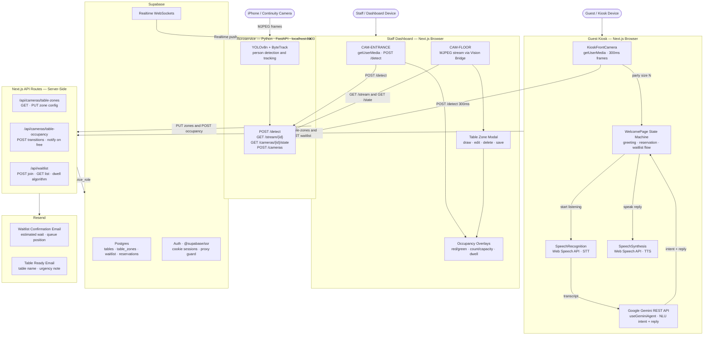

# System Architecture — Whiteboard Diagram

> For detailed flow descriptions (kiosk voice flow, waitlist algorithm, database schema, file map) see [architecture.md](./architecture.md).

```mermaid
flowchart TB
    %% ── Actors ──────────────────────────────────────────────────────────
    iPhone(["iPhone / Continuity Camera"])
    Guest(["Guest / Kiosk Device"])
    Staff(["Staff / Dashboard Device"])

    %% ── Vision Microservice ─────────────────────────────────────────────
    subgraph Vision ["Vision Microservice — Python · FastAPI · localhost:8000"]
        YOLO["YOLOv8n + ByteTrack<br/>person detection and tracking"]
        VisionAPI["POST /detect<br/>GET /stream/{id}<br/>GET /cameras/{id}/state<br/>POST /cameras"]
        YOLO --> VisionAPI
    end

    %% ── Guest Kiosk ─────────────────────────────────────────────────────
    subgraph Kiosk ["Guest Kiosk — Next.js Browser"]
        KioskCam["KioskFrontCamera<br/>getUserMedia · 300ms frames"]
        SM["WelcomePage State Machine<br/>greeting · reservation · waitlist flow"]
        STT["SpeechRecognition<br/>Web Speech API · STT"]
        Gem["Google Gemini REST API<br/>useGeminiAgent · NLU intent + reply"]
        TTS["SpeechSynthesis<br/>Web Speech API · TTS"]

        KioskCam -->|party size N| SM
        SM -->|start listening| STT
        STT -->|transcript| Gem
        Gem -->|intent + reply| SM
        SM -->|speak reply| TTS
    end

    %% ── Staff Dashboard ─────────────────────────────────────────────────
    subgraph Dash ["Staff Dashboard — Next.js Browser"]
        EC["CAM-ENTRANCE<br/>getUserMedia · POST /detect"]
        DC["CAM-FLOOR<br/>MJPEG stream via Vision Bridge"]
        ZM["Table Zone Modal<br/>draw · edit · delete · save"]
        OV["Occupancy Overlays<br/>red/green · count/capacity · dwell"]

        EC --> OV
        DC --> ZM --> OV
    end

    %% ── Next.js API Routes ──────────────────────────────────────────────
    subgraph API ["Next.js API Routes — Server-Side"]
        R1["/api/cameras/table-zones<br/>GET · PUT zone config"]
        R2["/api/cameras/table-occupancy<br/>POST transitions · notify on free"]
        R3["/api/waitlist<br/>POST join · GET list · dwell algorithm"]
    end

    %% ── Supabase ────────────────────────────────────────────────────────
    subgraph SB ["Supabase"]
        PG["Postgres<br/>tables · table_zones · waitlist · reservations"]
        RT["Realtime WebSockets"]
        AU["Auth · @supabase/ssr<br/>cookie sessions · proxy guard"]
    end

    %% ── Resend ──────────────────────────────────────────────────────────
    subgraph RS ["Resend"]
        RE1["Waitlist Confirmation Email<br/>estimated wait · queue position"]
        RE2["Table Ready Email<br/>table name · urgency note"]
    end

    %% ── Cross-subgraph connections ───────────────────────────────────────
    iPhone -->|MJPEG frames| Vision
    Guest --> Kiosk
    Staff --> Dash

    KioskCam -->|POST /detect 300ms| VisionAPI
    EC -->|POST /detect| VisionAPI
    DC -->|GET /stream and GET /state| VisionAPI

    Kiosk -->|GET table-zones and POST waitlist| API
    Dash -->|PUT zones and POST occupancy| API

    API -->|service_role| SB
    API --> RS
    RT -->|Realtime push| Dash
```
